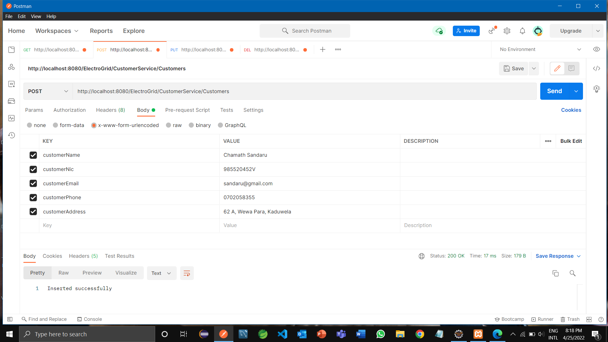
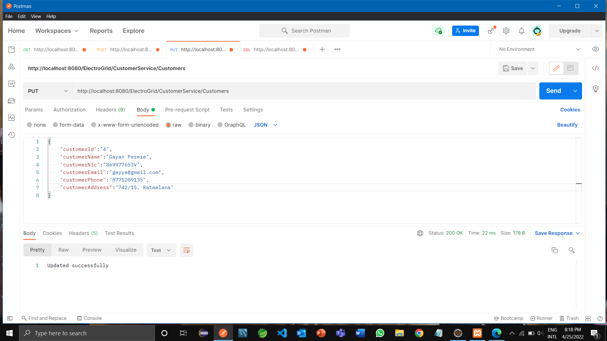
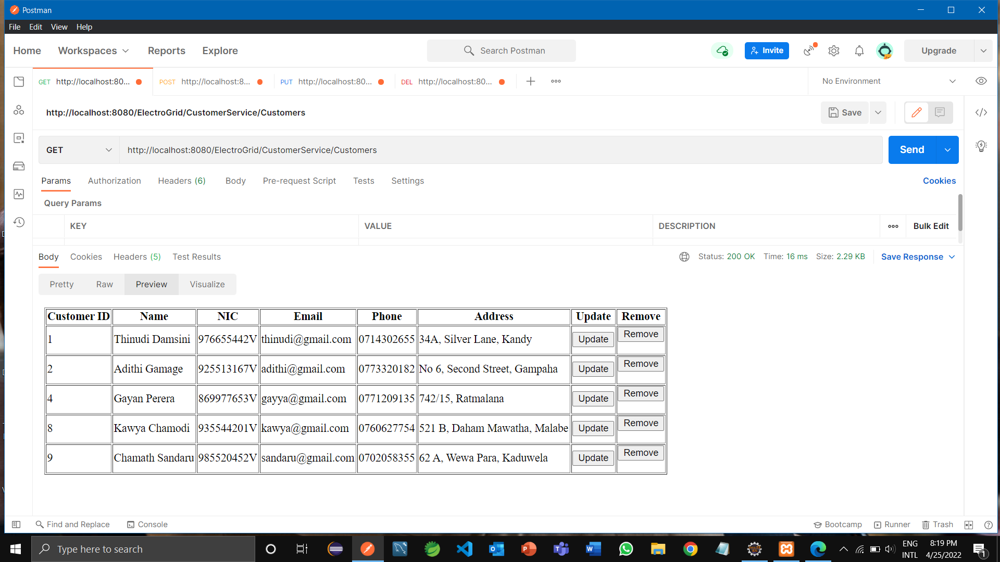
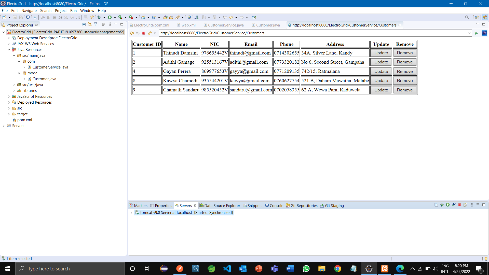
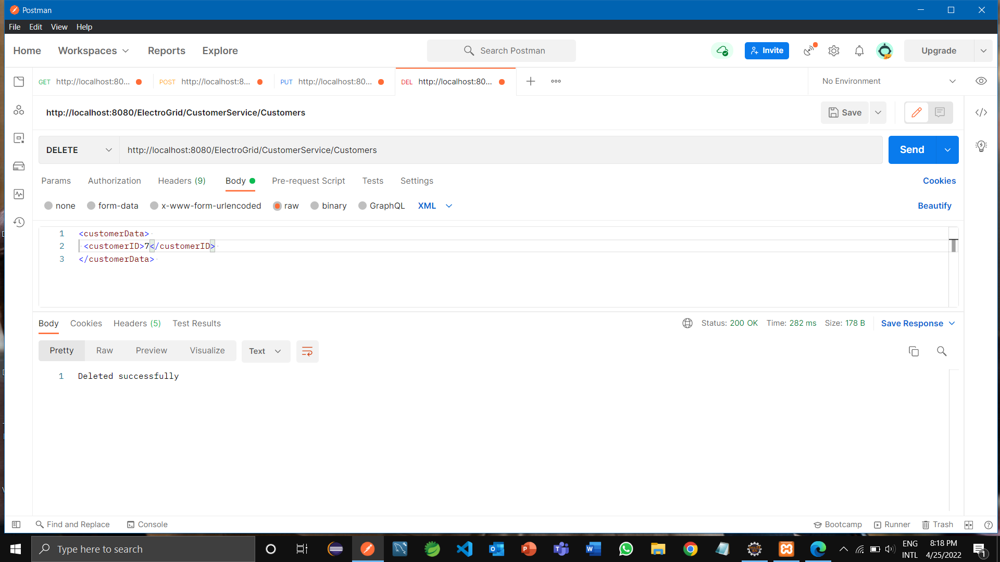
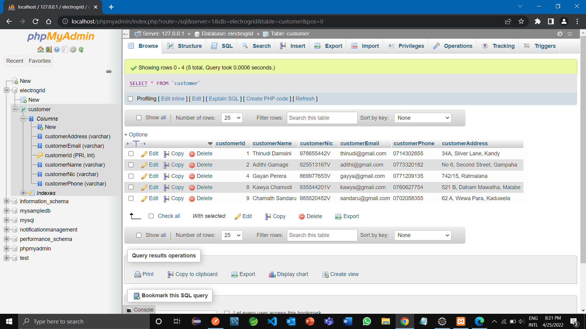

# ElectroGrid_Customer-Management
This is a group project done for the module 'Programming Applications & Frameworks' in 1st semester of 3rd year. The Electro-Grid Company is a power company that manages the power grid of the country. This focuses on helping Electro-Grid manage their services. This system contains six different services. They are: Customer management service, Emergency service management service, Payment management service, Bill management service, Solar panel 
power management service and Notification management service.

## Customer Management Service (Individual part)

### Flow chart

### API of the service

### Class diagram

### Activity diagram

### Sequence diagram

### ER diagram

### Allows users to register to the ElectroGrid system by entering their details.

### Users can update the previously entered details as well.

### All the details of registered customers can be viewed by the service.

### Registered customers can be removed from the system by deleting their details.

### Customer database

## Tools & technologies
- Backend - Java/JAX-RS (Jersey)
- Database - MySQL
- DBMS - phpMyAdmin
- Server - Apache Tomcat server version 09
- Dependency Management Tool - Maven
- IDE - Eclipse IDE Enterprise Edition
- Testing tool - Postman as the client side testing tool
