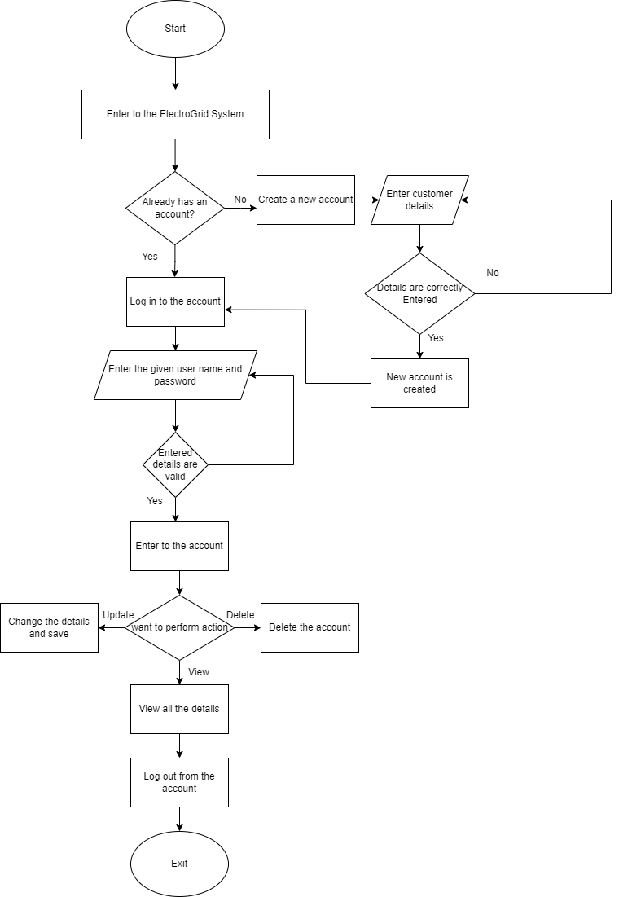
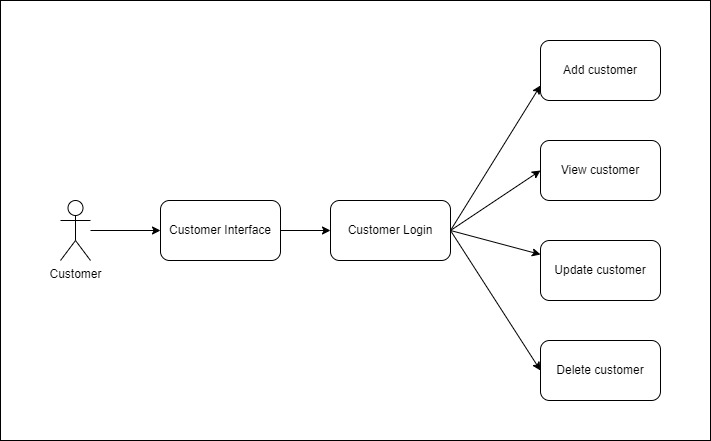
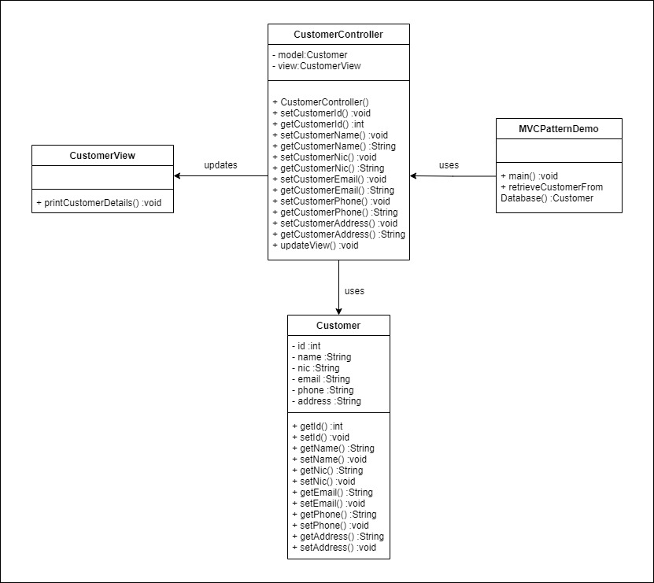
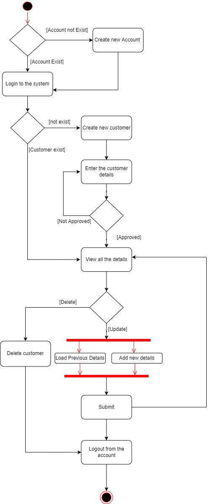
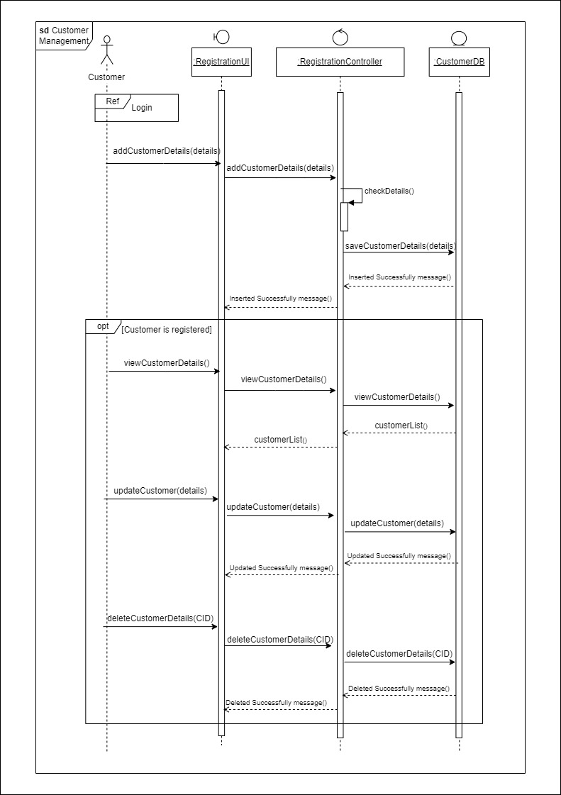
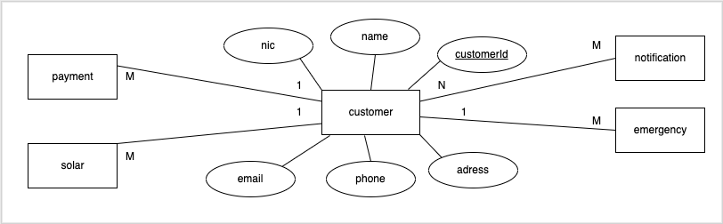

# ElectroGrid_Customer-Management
The Electro-Grid Company is a power company that manages the power grid of the country. This is 
a Java-RS based back end system that focuses on helping Electro-Grid manage their services.

## Customer Management
Customer Management Service allows users to register to the ElectroGrid system by 
entering their details. Users can update the previously entered details as well. All the details of 
registered customers can be viewed by the service. Registered customers can be removed from 
the system by deleting their details.

### Flow chart

### API of the service

### Class diagram

### Activity diagram

### Sequence diagram

### ER diagram

### Add customer
### Update customer
### Delete customer
### Read all customers
### View all customers in Eclipse
### Customer database

## Tools & technologies
- Backend - Java/JAX-RS (Jersey)
- Database - MySQL
- DBMS - phpMyAdmin
- Server - Apache Tomcat server version 09
- Dependency Management Tool - Maven
- IDE - Eclipse IDE Enterprise Edition
- Testing tool - Postman as the client side testing tool
